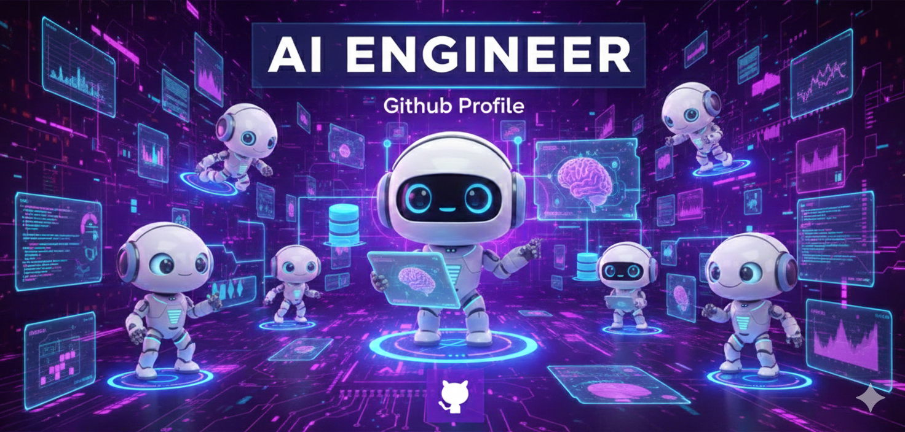

<div align="center">
  
  <!-- BANNER HEADER: Tu imagen personalizada -->
  

  <!-- TYPING ANIMATION: Efecto de escritura -->
  

  <!-- SOCIAL BADGES: Conexiones -->
  <p>
    <a href="https://www.linkedin.com/in/ronny-camacho-4b9a3438a">
      
    </a>
    <a href="https://twitter.com/RACPSC2025">
      
    </a>
    <a href="mailto:rac.ia.2025@gmail.com">
      
    </a>
  </p>

  <!-- PROFILE VIEWS -->
  

</div>

---

## 🤖 About Me

```python
class AIAutomationEngineer:
    def __init__(self):
        self.name = "Ronny Camacho"
        self.role = "AI Automation Specialist"
        self.mission = "Building intelligent agents that work while you sleep 🌙"
        
    def specialization(self):
        return {
            "core": "Multi-Agent Systems & Automation",
            "focus": ["LangChain", "CrewAI", "LangGraph", "FastAPI"],
            "building": "Autonomous AI Workflows",
            "passion": "Making AI accessible and practical"
        }
    
    def tech_stack(self):
        return {
            "backend": ["Python", "FastAPI", "Django"],
            "frontend": ["React", "Next.js", "Angular", "TypeScript"],
            "databases": ["PostgreSQL", "MySQL", "Redis"],
            "infrastructure": ["Docker", "Kubernetes"]
        }
```

<details>
<summary>🎯 Current Focus</summary>
<br>

Transforming businesses through **AI Automation** and **Multi-Agent Systems**. Expert in orchestrating intelligent agents that handle complex workflows autonomously.

- 🔭 Building: **Enterprise Automation Pipelines**
- 🌱 Mastering: **Agent Orchestration at Scale**
- 💬 Ask me about: **AI Agents, Automation, Python, FastAPI**
- ⚡ Philosophy: **Automate the boring, focus on innovation**

</details>

---

## 🛠️ Tech Stack

### Backend & AI Frameworks
<div align="center">
  
  
  
  <br/>
  <!-- AI Specific Badges -->
  
  
  
</div>

### Frontend Development
<div align="center">
  
  
  
  
  
</div>

### Data & Infrastructure
<div align="center">
  
  
  
  <br/>
  
  
</div>

---

## 📊 GitHub Analytics

<div align="center">
  <!-- Stats Card con tema Dark/Purple -->
  
  
  <!-- Streak Card -->
  
</div>

<div align="center">
  <!-- Top Languages Donut Chart -->
  
  
  <!-- Productive Time -->
  
</div>

---

## 🏆 GitHub Trophies

<div align="center">
  <!-- Trofeos con tema Radical (Dark/Purple) -->
  
</div>

---

## 📈 Contribution Activity

<div align="center">
  
</div>

---

## 🐍 Contribution Snake

<picture>
  <source media="(prefers-color-scheme: dark)" srcset="https://raw.githubusercontent.com/RACPSC2025/RACPSC2025/output/github-contribution-grid-snake-dark.svg">
  <source media="(prefers-color-scheme: light)" srcset="https://raw.githubusercontent.com/RACPSC2025/RACPSC2025/output/github-contribution-grid-snake.svg">
  
</picture>

---

## 🎯 Featured Projects

<div align="center">

<a href="https://github.com/RACPSC2025/Professional-AI-Agent-Developer-Course-v1.0">
  
</a>

</div>

---

## 🌐 Let's Build the Future Together

<div align="center">
  
  **Passionate about AI-driven automation and intelligent systems**
  
  [](https://www.linkedin.com/in/ronny-camacho-4b9a3438a)
  [](mailto:rac.ia.2025@gmail.com)
  
  <sub>🤖 Building tomorrow's automation, today</sub>
  
</div>

---

<div align="center">
  
  
  <sub>💜 Powered by AI & Passion for Innovation</sub>
</div>

